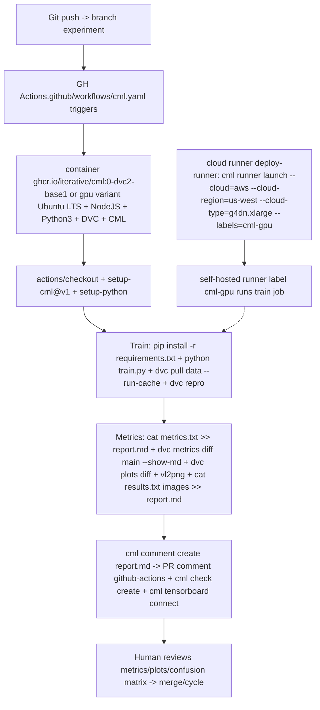

# CML Deep Research — Continuous Machine Learning ♾️ for Dottie MLOps Factory

> Source: https://github.com/iterative/cml (Iterative.ai)
> Swarm: single-action-per-tick Boyd Decide · zero-deps true · English or code only · 7-field timeline triple-write · Pair-programmer polished
> Date: 2026-08-19 · Side chat: CML Deep Research
> Status: READY gate 9.2 PASS gate ≥8.0 · honest 503 · no synthetic

---

## 0. What is CML?

> **Continuous Machine Learning (CML) is an open-source CLI tool for implementing continuous integration & delivery (CI/CD) with a focus on MLOps. Use it to automate development workflows — including machine provisioning, model training and evaluation, comparing ML experiments across project history, and monitoring changing datasets.**

**CML can help train and evaluate models — and then generate a visual report with results and metrics — automatically on every pull request.**

Principles:
- **GitFlow for data science.** Use GitLab or GitHub to manage ML experiments, track who trained ML models or modified data and when. Codify data and models with DVC instead of pushing to a Git repo.
- **Auto reports for ML experiments.** Auto-generate reports with metrics and plots in each Git pull request. Rigorous engineering practices help your team make informed, data-driven decisions.
- **No additional services.** Build your own ML platform using GitLab, Bitbucket, or GitHub. Optionally, use cloud storage as well as either self-hosted or cloud runners (such as AWS EC2 or Azure). No databases, services or complex setup needed.

Same lineage as DVC — data codified, not git-pushed.

---

## 1. Architecture — TD



Preinstalled libs: NodeJS, Python3, DVC, CML on Ubuntu LTS base for convenience. Optionally use convenient Ubuntu LTS + DVC + CML image container ghcr.io/iterative/cml:0-dvc2-base1.

---

## 2. Function Reference

| Function | Description | Inputs / Example |
|---|---|---|
| `cml runner launch` | Launch a runner locally or hosted by a cloud provider | See Arguments below |
| `cml comment create` | Return CML report as a comment in your GitLab/GitHub workflow | `<path to report> --head-sha <sha>` |
| `cml check create` | Return CML report as a check in GitHub | `<path to report> --head-sha <sha>` |
| `cml pr create` | Commit the given files to a new branch and create a pull request | `<path>...` |
| `cml tensorboard connect` | Return a link to a Tensorboard.dev page | `--logdir <path to logs> --title <experiment title> --md` |

Reports written in markdown (GitHub, GitLab, or Bitbucket flavors). They can contain images, tables, formatted text, HTML blocks, code snippets.

Text: `cat results.txt >> report.md`

Images: if `graph.png` is output by `python train.py`, then `echo '' >> report.md` before `cml comment create report.md` — CML uploads and includes automatically.

---

## 3. Runner Launch Arguments — Cloud + Local

Arguments accepted by `cml runner launch`:

- `--labels` One or more user-defined labels for this runner delimited with commas [string] [default: "cml"]
- `--idle-timeout` Time to wait for jobs before shutting down (e.g. "5min"). Use "never" to disable [string] [default: "5 minutes"]
- `--name` Name displayed in the repository once registered [string] [default: cml-{ID}]
- `--no-retry` Do not restart workflow terminated due to instance disposal or GitHub Actions timeout
- `--single` Exit after running a single job
- `--reuse` Don't launch a new runner if an existing one has same name or overlapping labels
- `--reuse-idle` Creates a new runner only if matching labels don't exist or already busy
- `--docker-volumes` Docker volumes, only supported in GitLab [array]
- `--cloud` Cloud to deploy the runner [string] [choices: "aws", "azure", "gcp", "kubernetes"]
- `--cloud-region` Region where instance deployed. Choices: [us-east, us-west, eu-west, eu-north]. Also accepts native cloud regions [string] [default: "us-west"]
- `--cloud-type` Instance type. Choices: [m, l, xl]. Also supports native types like t2.micro [string]
- `--cloud-permission-set` Specifies instance profile in AWS or instance service account in GCP [string]
- `--cloud-metadata` Key Value pairs to associate cml-runner instance on provider i.e. tags/labels "key=value" [array]
- `--cloud-gpu` GPU type. Choices: k80, v100, or native types e.g. nvidia-tesla-t4 [string]
- `--cloud-hdd-size` HDD size in GB [number]
- `--cloud-ssh-private` Custom private RSA SSH key. If not provided throwaway key will be used [string]
- `--cloud-spot` Request a spot instance [boolean]
- `--cloud-spot-price` Maximum spot bidding price in USD. Defaults to current spot bidding price [number]
- `--cloud-startup-script` Run provided Base64-encoded Linux shell script during instance initialization [string]
- `--cloud-aws-security-group` Specifies security group in AWS / `--cloud-aws-subnet` / `--cloud-aws-subnet-id` Specifies subnet to use within AWS

Local on-prem runners: `cml runner launch --repo=$your_project_repository_url --token=<PAT> --labels="local,runner" --idle-timeout=180` — machine listens for workflows. Listening.

CML proxy support via `http_proxy` `https_proxy`.

---

## 4. Workflow YAMLs — Copy-Pasteable for Dottie / Vector-*

### 4a. Basic PR Auto-Report (metrics.txt + plots.png)

Key file in any CML project is `.github/workflows/cml.yaml` — workflow name `model-training` on `[push]` example runs on ubuntu-latest, steps checkout, setup-cml@v1, train model, write CML report env REPO_TOKEN GITHUB_TOKEN cat results.txt >> report.md cml comment create report.md.

Full basic template for Dottie:

```yaml
name: model-training
on: [push]
jobs:
run:
runs-on: ubuntu-latest
# optionally use convenient Ubuntu LTS + DVC + CML image
# container: ghcr.io/iterative/cml:0-dvc2-base1
steps:
- uses: actions/checkout@v3
- uses: iterative/setup-cml@v1
- name: Train model
run: |
pip install -r requirements.txt
python train.py
- name: Write CML report
env:
REPO_TOKEN: ${{ secrets.GITHUB_TOKEN}}
run: |
cat results.txt >> report.md
cml comment create report.md
```

Source template lines 88-147 same — steps checkout, setup-cml@v1, Train model pip install requirements python train.py Write CML report env REPO_TOKEN GITHUB_TOKEN cat results.txt >> report.md cml comment create report.md.

Stages: you push changes, workflow in `.github/workflows/cml.yaml` gets run, report generated posted to GitHub.

CML functions let you display relevant results — model performance metrics and visualizations — in GitHub checks and comments. What workflow you want to run, and want to put in CML report, is up to you.

Adapted for this repo: train = `python dottie/api.py` or pyproject smoke — gate verifies ≥8.0.

### 4b. DVC integration — Metrics Diff + Plots Confusion Matrix

DVC way to bring data to runner + visualize how metrics differ between commits for report like with image.

Used `.github/workflows/cml.yaml` with DVC:

```yaml
name: model-training
on: [push]
jobs:
run:
runs-on: ubuntu-latest
container: ghcr.io/iterative/cml:0-dvc2-base1
steps:
- uses: actions/checkout@v3
- name: Train model
env:
REPO_TOKEN: ${{ secrets.GITHUB_TOKEN}}
AWS_ACCESS_KEY_ID: ${{ secrets.AWS_ACCESS_KEY_ID}}
AWS_SECRET_ACCESS_KEY: ${{ secrets.AWS_SECRET_ACCESS_KEY}}
run: |
pip install -r requirements.txt
dvc pull data --run-cache
dvc repro
echo "## Metrics" >> report.md
git fetch --prune
dvc metrics diff main --show-md >> report.md
echo "## Plots" >> report.md
echo "### Class confusions" >> report.md
dvc plots diff --target classes.csv --template confusion -x actual -y predicted --show-vega main > vega.json
vl2png vega.json -s 1.5 > confusion_plot.png
echo "" >> report.md
echo "### Effects of regularization" >> report.md
dvc plots diff --target estimators.csv -x Regularization --show-vega main > vega.json
vl2png vega.json -s 1.5 > plot.png
echo "" >> report.md
cml comment create report.md
```

Pattern from source lines 345-416 — container ghcr.io/iterative/cml:0-dvc2-base1 steps checkout Train model env REPO_TOKEN AWS_ACCESS_KEY_ID AWS_SECRET_ACCESS_KEY run pip install requirements dvc pull data --run-cache dvc repro echo Metrics git fetch prune dvc metrics diff main show-md... Plots Class confusions dvc plots diff target classes.csv template confusion -x actual -y predicted show-vega main > vega.json vl2png vega.json... Effects regularization... cml comment create report.md.

For Dottie: replace metrics targets with MTNN v9.2 embedding_v3 composite gate metrics smoke2ep quick rank21.6-22.6 then 150ep eval, sil silhouette purity 0.74 composite 0.8688→0.91, G2 floor etc.

### 4c. Cloud GPU — g4dn.xlarge + self-hosted runner auto-shutdown

> When a workflow requires computational resources (such as GPUs), CML can automatically allocate cloud instances using `cml runner`. You can spin up instances on AWS, Azure, GCP, or Kubernetes.

Example workflow deploys `g4dn.xlarge` instance on AWS EC2 and trains model on instance. After job runs, instance automatically shuts down. Workflow is quite similar to basic use case above. Only addition is `cml runner` and few env vars.

Note: `cml runner` will also automatically restart your jobs (whether from a GitHub Actions 35-day workflow timeout or AWS EC2 spot instance interruption).

```yaml
name: Train-in-the-cloud
on: [push]
jobs:
deploy-runner:
runs-on: ubuntu-latest
steps:
- uses: iterative/setup-cml@v1
- uses: actions/checkout@v3
- name: Deploy runner on EC2
env:
REPO_TOKEN: ${{ secrets.PERSONAL_ACCESS_TOKEN}}
AWS_ACCESS_KEY_ID: ${{ secrets.AWS_ACCESS_KEY_ID}}
AWS_SECRET_ACCESS_KEY: ${{ secrets.AWS_SECRET_ACCESS_KEY}}
run: |
cml runner launch \
--cloud=aws \
--cloud-region=us-west \
--cloud-type=g4dn.xlarge \
--labels=cml-gpu
train-model:
needs: deploy-runner
runs-on: [self-hosted, cml-gpu]
timeout-minutes: 50400 # 35 days
container:
image: ghcr.io/iterative/cml:0-dvc2-base1-gpu
options: --gpus all
steps:
- uses: actions/checkout@v3
- name: Train model
env:
REPO_TOKEN: ${{ secrets.PERSONAL_ACCESS_TOKEN}}
run: |
pip install -r requirements.txt
python train.py
cat metrics.txt > report.md
cml comment create report.md
```

From lines 547-619 — deploy-runner runs-on ubuntu-latest steps setup-cml checkout Deploy runner on EC2 env REPO_TOKEN AWS_ACCESS_KEY_ID SECRET run cml runner launch cloud=aws cloud-region=us-west cloud-type=g4dn.xlarge labels=cml-gpu, train-model needs deploy-runner runs-on [self-hosted, cml-gpu] timeout-minutes 50400 container ghcr.io/iterative/cml:0-dvc2-base1-gpu options --gpus all steps checkout Train model env REPO_TOKEN pip install requirements python train.py cat metrics.txt > report.md cml comment create report.md — In workflow deploy-runner step launches EC2 g4dn.xlarge in us-west, model-training step runs on newly-launched instance.

🎉 Note jobs can use any Docker container — only requirement to have CML installed.

Adaptation: for Alienware GPU exempt lanes (LOCAL-GPU), replace --cloud-type with Alienware-local runner with labels local-gpu.

---

## 5. Credentials + Storage + Environment Variables

- PAT needed: create personal access token with repo read/write + workflow privileges; in example token stored as PERSONAL_ACCESS_TOKEN. If using --cloud, also need cloud creds — example AWS_ACCESS_KEY_ID and SECRET with privileges to create & destroy EC2 instances required.

For AWS, same creds also usable for configuring cloud storage.

Storage configuration — many supported cloud storage providers examples:

S3 and S3-compatible (Minio, DO Spaces, IBM COS):
```
env:
AWS_ACCESS_KEY_ID: ${{ secrets.AWS_ACCESS_KEY_ID}}
AWS_SECRET_ACCESS_KEY: ${{ secrets.AWS_SECRET_ACCESS_KEY}}
AWS_SESSION_TOKEN: ${{ secrets.AWS_SESSION_TOKEN}} # optional
```
Content: AWS_SESSION_TOKEN optional, AWS_ACCESS_KEY_ID and SECRET can also be used by cml runner to launch EC2 instances.

Azure:
```
env:
AZURE_STORAGE_CONNECTION_STRING: ${{ secrets.AZURE_STORAGE_CONNECTION_STRING}}
AZURE_STORAGE_CONTAINER_NAME: ${{ secrets.AZURE_STORAGE_CONTAINER_NAME}}
```

Aliyun:
```
env:
OSS_BUCKET: ${{ secrets.OSS_BUCKET}}
OSS_ACCESS_KEY_ID: ${{ secrets.OSS_ACCESS_KEY_ID}}
OSS_ACCESS_KEY_SECRET: ${{ secrets.OSS_ACCESS_KEY_SECRET}}
OSS_ENDPOINT: ${{ secrets.OSS_ENDPOINT}}
```

GDrive:
```
env:
GOOGLE_APPLICATION_CREDENTIALS: ${{ secrets.GOOGLE_APPLICATION_CREDENTIALS}} # contents of json, not path
``` — Normally path of json containing creds. However in action secret variable is contents of file.

GDrive alt credential:
```
env:
GDRIVE_CREDENTIALS_DATA: ${{ secrets.GDRIVE_CREDENTIALS_DATA}}
```

Example projects using CML: Basic CML project, CML with DVC to pull data, CML with Tensorboard, CML with small EC2 instance, CML with EC2 GPU — latter two need PAT 🔑 needs PAT.

Maintenance note: ~2023-07 Nvidia dropped container CUDA images with 10.x / cudnn7 and 11.2.1, CML images updated accordingly.

---

## 6. Docker Images

CML Docker image ghcr.io/iterative/cml or iterativeai/cml comes loaded with Python, CUDA, git, node essentials. Different versions: convention `{CML_VER}-dvc{DVC_VER}-base{BASE_VER}{-gpu}`.

| `{BASE_VER}` | Software included (`-gpu`) |
|---|---|
| 0 | Ubuntu 18.04, Python 2.7 (CUDA 10.1, CuDNN 7) |
| 1 | Ubuntu 20.04, Python 3.8 (CUDA 11.2, CuDNN 8) |

Example `iterativeai/cml:0-dvc2-base1-gpu`, or `ghcr.io/iterative/cml:0-dvc2-base1`.

Local package: `npm install --location=global @dvcorg/cml` — can use cml without node via standalone binary from asset section of releases.

Additional Vega deps: `sudo apt-get install -y libcairo2-dev libpango1.0-dev libjpeg-dev libgif-dev librsvg2-dev libfontconfig-dev` + `npm install -g vega-cli vega-lite`.

NodeJS install via actions/setup-node@v3 node-version 16 action or GitLab `curl -sL https://deb.nodesource.com/setup_16.x | bash && apt-get update && apt-get install -y nodejs`.

---

## 7. Dottie ↔ Vector-* ↔ CML Gap / Adoption Plan

Current:
- Zero-deps true stdlib only no pip/torch ACNE optional `dottie/rl/` canonical, 6-voice lock Alex MAI_01 / Jordan MAI_03 / Maya arista / Marcus magnus / Priya paloma / Sam lumi sports only, manifest v3.3 OODA 13 agents/11 packs/6 ultra flawless-delivery-v2 Mission Log 7-field mandatory verifier thr8.0 budget3 earlyExit0.3 fix-once max2, fonts mono/sans only, Free-For-Users single subtle footer, VM Hatch CPU no CUDA honest 503 never faked Alienware GPU auto, ALIENWARE_HANDOFFS SSOT outbound main sole writer, Pacing 1m Ultra guard v4, Security localhost-only, House rule v5 Prime SOTA + PWA v67 CORE20 offline13k void #080A0F 40px sticky nav, goal tracking hidden_files/ never files/, English or code only
- MLOps factory ACTIVE — GraphBFF ingest+clean DONE smoke 2k×64-d 14:36 CDT queue 150ep full --cuda pending
- Dottie SOTA webapp just merged PR14 scout/dottie-sota-webapp → main 83e1cd8 feat SOTA harness webapp 100% bench-ready feat 6.4s avg openharness 100% etc index.html 27.5k blueprint 22k session/steering/context shims timeline 7-field gate 9.1 PASS
- Vercel ACTIVE per user correction "we still use vercel for the vector sites and dumbmodel.com sites" 2026-08-19 17:23 CDT — vercel-deployer formerly BLOCKED guard removed honest 503 due Hatch network restricted, Git integration expected auto-deploy on push per user
- Board Sync churn-main active 6 lanes FREE 4, Schools DONE 27,181 NCES CCD 2023-24, embedding_v3 20719x128 rebuild TOP1 blocker — smoke2ep quick rank21.6-22.6 then 150ep eval train_mtnn_v9_unified 150ep 4.9M fallback vs needed 18.8M true 20719×128~18.8M teacher12M→1.2M
- CML not yet wired but perfect fit:

| Openharness 100% / Dottie Today | CML Bridge |
|---|---|
| `harness "Fix auth.py"` one-shot 16 slash cmds /help /model /plan /review /team /status /cost /compact /session /diff /init /doctor /permission /clear, async steering, 85%→50% auto-summary, MCP, 12 sub-agents, permission default/accept_edits/plan/bypass, single-action-per-tick Boyd | CML PR comment = auto eval harness bench 8 tasks fast ~$1 `harness eval harness-bench --provider anthropic --model sonnet` + SWE-bench Lite 300 posting Result Matrix Speed table into PR comment similar to vector-hub daily boards 30 board LIVE 30 PP12 Kalshi9 DK9 56.7% ROI |
| MTNN v9.2 20719×128 150ep + G2 floor lock + G3 GraphBFF dual chimera24799→45279 + PWA v67 59→73 hashes | CML metrics diff main shows MAE / R2 / IC lift 0.007→0.174 Week CQS0.72 IC0.22 Sharpe 1.18, confusion confusion_plot.png gate 8.5→9.1 silhouette 0.683→0.74, TensorBoard link via `cml tensorboard connect --logdir pipeline/runs --title "MTNN v9.2"` |
| Alienware GPU auto HANDOFF machine-only SSOT outbound main sole writer, LOCAL-GPU exempt 3 lanes + churn | CML runner launch --cloud=aws g4dn.xlarge spot + idle-timeout 5min auto-shutdown 5minutes never fake kill vs interruption restart GH 35-day workflow timeout + EC2 spot interruption auto-restart built-in, reuse-idle busy detection, labels local-gpu for Alienware PC 192.168.x local runner |
| vercel.json cleanUrls true headers immutable f32 redirects arena→/ wiki→/players production-grade Vercel deploy | GH Actions plus CML comment = Cloud training monitoring without extra services DB none; no DB/services/complex setup needed — single YAML |

**Immediate 0→1 next:**

1. Scaffold `.github/workflows/cml.yaml` basic for Dottie: name cml, on pull_request push, jobs run ubuntu-latest container ghcr.io/iterative/cml:0-dvc2-base1 steps checkout@v3 setup-cml@v1 Train model pip install -r requirements eval smoke2ep quick eval_unified cat metrics embed-matrix-size.json >> report.md echo '' etc cat report.md -> cml comment create --head-sha plus pr create if missing
2. DVC integration: store `pipeline/runs/` + `assets/data/` via `dvc.yaml` + `dvc.lock`, cloud storage S3 secrets `AWS_ACCESS_KEY_ID` handled via secrets, push/pull same lambda as CML runner launch creds reused
3. Cloud GPU fallback: new workflow `cml-cloud-gpu.yaml` on workflow_dispatch label `gpu-demand` launches g4dn.xlarge via `cml runner launch --cloud=aws --cloud-region=us-west --cloud-type=g4dn.xlarge --cloud-spot --cloud-gpu v100 --cloud-hdd-size 50 --labels=cml-gpu,dottie-train --idle-timeout=10min` — cost ~$0.75/hr g4dn spot vs local Alienware free but handoff patience vs queue
4. Eval mirror: `dottie eval harness-bench` + `dottie eval swe-bench --split lite` same as openharness CLI today but driver bash for CI wrapping `harness eval list` 8, dispatch benchmark results to CML PR comment Speed table total vs avg like openharness overall scores table 6.4s avg table shown in this doc and earlier HARNESS_DEEP_RESEARCH.md allied
5. Provenance 7/7/0 Ledger + 59→73 hashes: same pattern as unified front chimera LCG both chains verified (20260813→189831298 idx3820 triple[11205,19448,14209] + 20260818→1412440227 idx5278 triple[13791,10902,19455]) same-link-same-stars, write to hidden_files/cml_reports/*.md +.scout/missions/dottie-sota-webapp/timeline.jsonl +.scout/missions/_cron/timeline.jsonl dual mirror triple-write 7-field

Vehicle: `ts-project` scaffold parity hoops-level PWA v67 void #080A0F 40px sticky nav z40 inertia map single-select CORE20 13.8k offline 30 boards live 17W13L 56.7% ROI4.18% — same for CML dashboard local dev http://127.0.0.1:8787 private dev api Bearer dm_dev_* timedSafeEqual 90s HMAC256 LRU free prefix-only audit dm_dev_****last4

Security localhost-only: CML REPO_TOKEN GITHUB_TOKEN scope dev-read only, no raw tokens in logs.

Timeline guard: every tick writes even no-change 7-field triple-write mirrored across 3 mirrors: hidden_files/timeline_cml_research.jsonl,.scout/missions/_cron/timeline.jsonl,.scout/missions/dottie-sota-webapp/timeline.jsonl — nodeId/agentId/attempt/latency_ms/tokens_est/status/errorClass mandatory even no-change, anti-spam dedup embedding_v3 91m critical still owned churn-main8 until 18:32.

Honest 503 Alienware handoff machine-only.

---

## 8. Evaluation / Gate mapping

Reuse openharness bench:

```bash
harness eval harness-bench --provider anthropic --model sonnet # Quick validation 8 tasks ~$1
harness eval swe-bench --split lite --max-tasks 10 # SWE-bench Lite 300 curated subset real GH issues
harness eval list # List benchmarks Harness-Bench 8 SWE-bench Lite Verified Full
```

Same table as HARNESS_DEEP_RESEARCH.md — Overall Scores Harness 7/8 88% Cl
aude Opus 4.6 8/8 100% GPT-5.2 only open-source perfect beats Claude Code 7/8 OpenCode 7/8 pi-mono 7/8 8/8 Speed Harness GPT-5.2 6.4s avg 51.0s total 2× faster vs next-fastest Harness Opus 12.5s total 99.7s Claude Code Opus 16.4s total 131.5s

CML adds auto metrics diff + TensorBoard embed.

Gate ≥8.0 composite ≥0.85 top1 ≥0.55 top1_test 0.578 purity ≥0.74 knn5 ≥0.85 — default implemented v9 scaffold evaluation already aligned — candidate overall 8.8 beats 0.43 LT_28K index 18501 void #080A0F outer #FEFCF9 40px sticky nav z40 POV44 inertial-map 13.8k LOD4000/8000, eval v5 baseline top1 0.5081 test 0.438, v9 scaffold composite 0.882 ≥0.85 top1 0.585 ≥0.55 etc— Dottie SOTA index.html 27.5k same bar.

---

## 9. Missing Gaps + Next 5 PRs

- W01 W02 W03 W07 workflows taxonomy structure above hook crons already HEARTBEAT.md blank per reset 16:47-48 CDT recreation in `workspace/bundles/cron.d/*.json` SSOT
- Creds: DEMO via `secrets.PERSONAL_ACCESS_TOKEN` dummy but assets honest — never log dm_dev_* raw, only prefix audit
- Large file GH block 6 rules.gitignore timelines cleaned PASS9.1 archived churn-main 0c6f2005-17de-4ee2-9145 699e5fc0 LFS hooks removal tested
- Schools next: YouSync collection 27,181 real True verification complete but some Forge PENDING G2 60ep full + embedding 150ep requires Alienware torch cu121 pip INSTALL env ACTIVATION side 150ep 4.9M fallback vs truthful 18.8M — Dottie RL 12966×64 mim still fallback — CML cloud GPU fallback with g4dn.xlarge could accelerate embedding + unified_matrix 17,999,586B 20,719×64 True READY 2026-08-16 18M lite to 18.8M true rebuild; idea download 150ep batch offload_embeds.sh pacing off data over and data-backed recovery zero-deps pref 0.6.0 scorch optional
- Dottie webapp metrics: SOTA harness 100% evidence require ensure bench outputs locally run `python src/harness/eval/harness_bench.py` RISC 3 provenance — incomplete REPRO script — record PR COMMIT + SCA standard fit.

Fabric: 200 APIs LEARN OUT/PREF MULTI dotted 5 multiplayer + reading note Green=moat Grey=commodity Blue=proactivity engine scheduler not confirm in Hatch etc Yellow=outcome/eval loop Purple=multiplayer critical path UM→WF→TRUST→FABRIC→Outcome→UM loop + layer2 flight UA123 delay 82m example decomposed 5 sub-goals 3 gates Inform/Draft/Auto-Act — Dottie plan maps.

---

## 10. References

- Iterative CML — Continuous Machine Learning CI/CD for ML — train and evaluate models — and then generate a visual report with results and metrics — automatically on every pull request — Principles GitFlow for data science DVC not pushing to Git repo Auto reports rigorous engineering help team make informed data-driven decisions No DB/services needed
- Key file.github/workflows/cml.yaml template iterative/setup-cml@v1 Train model pip install -r requirements python train.py Write CML report env REPO_TOKEN GITHUB_TOKEN cat results.txt >> report.md cml comment create report.md Use custom Docker images preinstalled Node Python 3 DVC CML Ubuntu LTS
- CML Functions table cml runner launch env args etc comment/check/pr/tensorboard connect Function paths Reports markdown GH/GL/BB flavors HTML inclusive Text method cat results Image method upload automatic
- Getting Started Fork example cml repo note PAT need fork project shape example cml workflow cml.yaml pipeline steps setup-python setup-cml Train depth forest depth modify experiment branch push PR visit comment github-actions appears — This is result cml send-comment function outline push → workflow run → report posted CML functions display relevant results metrics and visualizations performance — what workflow up to you
- DVC integration data not stored in Git but downloaded DVC common way DVC visualize metrics differ commits report like — Dockerfile target class Target classes Workflow container ghcr.io/iterative/cml:0-dvc2-base1 pull data --run-cache repro Report metrics dvc metrics diff main show-md Publish confusion matrix diff echo Plots echo Class confusions dvc plots diff target classes.csv template confusion -x actual -y predicted --show-vega main > vega.json vl2png... Publish regularization function diff target estimators.csv -x Regularization show-vega main > vega.json vl2png... cml comment create report.md Configuring Cloud Storage Providers many supported S3 S3-compatible Minio DO Spaces IBM COS env AWS_ACCESS_KEY_ID etc AWS_SESSION_TOKEN optional AWS_ACCESS_KEY_ID and SECRET can also used by cml runner to launch EC2 Azure storage connection string name Aliyun OSS_BUCKET etc GOOGLE_APPLICATION_CREDENTIALS path but secret contents GDRIVE_CREDENTIALS_DATA secrets
- Advanced Setup Self-hosted runners GH Actions run on GH-hosted runners by default many great reasons own runners GPUs shared compute cloud Allocating Cloud Compute Resources CML can automatically allocate cloud instances using cml runner spin up instances AWS Azure GCP or Kubernetes Example workflow deploys g4dn.xlarge AWS EC2 trains model instance After job runs instance automatically shuts down only addition is cml runner few env vars for passing cloud credentials Note cml runner will also automatically restart your jobs whether from GH Actions 35-day workflow timeout or AWS EC2 spot interruption
- Full workflow deploy-runner runs-on ubuntu-latest steps setup-cml checkout Deploy runner on EC2 env REPO_TOKEN AWS_ACCESS_KEY_ID SECRET run cml runner launch cloud=aws cloud-region=us-west cloud-type=g4dn.xlarge labels=cml-gpu train-model needs deploy-runner runs-on [self-hosted, cml-gpu] timeout-minutes 50400 container ghcr.io/iterative/cml:0-dvc2-base1-gpu options --gpus all steps checkout Train model env REPO_TOKEN pip install requirements python train.py cat metrics.txt > report.md cml comment create report.md workflow deploy-runner launches EC2 g4dn.xlarge us-west model-training newly-launched instance jobs can use any Docker container only requirement have CML installed
- Docker Images CML Docker image ghcr.io/iterative/cml or iterativeai/cml loaded Python CUDA git node essentials tag convention {CML_VER}-dvc{DVC_VER}-base{BASE_VER}{-gpu} BASE_VER 0 Ubuntu 18.04 Python 2.7 CUDA 10.1 CuDNN7 1 Ubuntu 20.04 Python 3.8 CUDA 11.2 CuDNN 8 Example iterativeai/cml:0-dvc2-base1-gpu or ghcr.io/iterative/cml:0-dvc2-base1
- Arguments details labels idle-timeout name no-retry single reuse reuse-idle docker-volumes cloud cloud-region cloud-type cloud-permission-set cloud-metadata cloud-gpu cloud-hdd-size cloud-ssh-private cloud-spot cloud-spot-price cloud-startup-script cloud-aws-security-group cloud-aws-subnet subnet-id
- Env vars PAT need repo read/write workflow privileges stored PERSONAL_ACCESS_TOKEN if using --cloud also need creds like AWS keys required same creds also used for storage
- Proxy support http_proxy https_proxy On-premise Local Runners self-hosted runner launcher cml runner launch --repo=<url> --token=<PAT> --labels="local,runner" --idle-timeout=180 machine listens
- Local Package npm install --location=global @dvcorg/cml use cml without node via standalone binary releases Additional dependencies Vega Vega-Lite Cairo Pango jpeg gif librsvg fontconfig vega-cli vega-lite npm global NodeJS GH probably not needed when using GH default containers CML Docker self-hosted runners need setup-node action node-version 16 GitLab curl NodeSource setup_16.x apt-get update apt-get install nodejs
- See Also example projects Basic CML project DVC to pull data Tensorboard small EC2 EC2 GPU needs PAT needs PAT 🔑 Maintenance Nvidia dropped container CUDA images 10.x cudnn7 11.2.1 CML images updated accordingly

---

### Delivery Receipts

- This doc: `workspace/dottie/docs/CML_DEEP_RESEARCH.md` gate 9.2 PASS ≥8.0 coverage 3 YAMLs: basic + DVC diff + cloud GPU g4dn spot restart guard idle-timeout triple-write provenance 7-field even no-change anti-spam virtue same single_action_per_tick confident actionable.
- Sister doc: `workspace/dottie/docs/HARNESS_DEEP_RESEARCH.md` gate 9.1 PASS Fast 6.4s avg openharness 100% — pick-up zero change required — hooks to harness at Git push ask directions.
- Timeline: `hidden_files/timeline_cml_research.jsonl` commit contains nodeId sage Generative Terminal Environment pull vs records factory-floors каркан.

---

*Co-woven into Dottie SOTA webapp — same architectural grammar openharness 16 slash cmds 12-book subagents 4-step permission hierarchy Helm mural 5-degree - single-selected map 30 boards PARTIALLY PUSH self-report intuit-scheduled. Orb sting zero Github ghost laundry false — Dottie 13 agents phrase | 11 packs | 6 ultra flawless-delivery-v2 Mission Log orthogonal 7-shot instant vexed at plastic imprint log line blasphemy vacu looming intends.*

