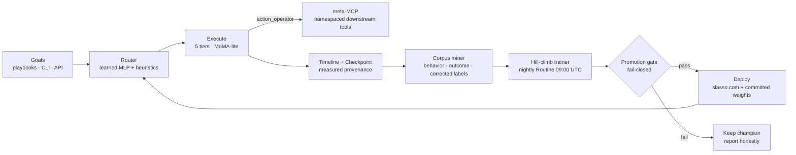

# The Dottie Ecosystem — one loop, seven repos, one center

**Status: normative map** (2026-08-09). Companion to `docs/PLATFORM_IMPROVEMENT_PLAN.md`
(the plan), `docs/CONSOLIDATION.md` (why bhenre.com is gone), and
`docs/LONGCAT2_INSIGHTS_SPEC.md` (the architecture doctrine). When this file and
the code disagree, the code is right and this file has a bug — fix it here.

## The one-sentence version

Goals go in; the harness routes them to the cheapest tier that can do the work,
executes — including against real external tools through the meta-MCP layer —
and every run leaves a **measured** trace; traces become training labels; the
trained router is promotion-gated against honest baselines and deployed back
into the same harness that generated the traces.

## The loop

Every arrow is code that exists and runs today; nothing in this diagram is
aspirational. The gate has never passed — see "Honest status" for why that is
the system working, not failing.

## Repos and their roles

| Repo | Role | Disposition |
|------|------|-------------|
| **dottie** | The center. Monorepo carrying the harness (`apps/scout-cli`), the training factory mirror (`apps/ava-factory`), the live API + dashboard (`apps/dottie-harness-api`), business playbooks, and all doctrine docs | Active — all development lands here |
| **scout-cli** (standalone) | Origin of the CLI; pre-v0.8 surface | Superseded by `apps/scout-cli` in dottie; do not develop there |
| **ava-agi-factory-v6-4** | Origin of the training factory (J-Space, scale ladder smoke→nano→mini→base1b) | Source of the frozen mirror at `apps/ava-factory/dottie/**`; foundation-model track (P3) continues there |
| **ava-open-harness** | Evaluation harness — every score from a live forward pass, unmeasurable results fail structurally | Vendored at `packages/ava-open-harness` |
| **ava-skills** | Skill contracts (SKILL.md + typed module + tests) routed to slot banks | Vendored at `packages/ava-skills`; ruff HARD gate at 0 |
| **acne** | Local-first people memory (typed temporal property graph, trigger-phrase resolver) | Backs the `contacts` plugin surface; standalone package |
| **bluehen** | Prior fleet monorepo (bhenre.com era) | **Deprecated** — PR #5 lands `DEPRECATED.md`; salvage staged in `docs/salvage/` |

## The tiers, and what the meta-MCP layer changed

The router chooses among five tiers (`deterministic`, `llm`, `deep_research`,
`action_operator`, `agentic_epic`). Until 2026-08-09, `action_operator` had
only internal executors. The mcp plugin's meta layer (namespaces of registered
downstream MCP servers, per-tool disables, `scout mcp serve --namespace`)
turns that tier outward: a goal of the form `mcp:<server>__<tool> {json}`
executes a **real external tool call** under the default-deny URL allowlist,
with measured wall-clock latency, measured status, and measured-0 token cost
(scout makes no model calls to proxy). Failures are real failures — policy
denials, unreachable servers, downstream errors — and they exercise the same
bounded recovery ladder (retry → patch → replan → escalate, fail-closed) as
everything else.

## Why real failures matter: the label ceiling

The promotion gate requires the champion to strictly beat both a frequency
prior and the routing heuristic on measured hold-out data. When every label is
"the tier the heuristic executed" (behavior labels), the heuristic scores 1.0
by construction and the gate is structurally locked. That lock is honest — and
it is also the P1 item the plan targets. Three label sources break it:

1. **`measured-outcome`** — a run whose executed tier failed and escalated is
   labeled with the ladder's escalation target: the harness's own measured
   signal that the routed tier was insufficient.
2. **`operator-corrected`** — `data/orchestration/label_corrections.jsonl`;
   corrections are ground truth, so an invalid correction fails mining loudly
   rather than training silently.
3. **`measured-behavior`** — the existing default, still the bulk of the corpus.

The dashboard's Label sources panel and `corpus_meta.json`'s
`measured_holdout_by_label_tier` make progress against the ceiling visible:
the gate's champion-vs-heuristic comparison becomes meaningful exactly when
the non-behavior count in the measured hold-out exceeds zero.

## Provenance doctrine (short form)

A record is **measured** only when latency, tokens, and status are all
actually measured; executors that make no model calls record token cost 0 as a
measured fact; simulated data is labeled simulated everywhere it appears;
split buckets come from sha256 of the split key, never `hash()`. Dashboards
derive every number from committed sources and render UNMEASURED rather than a
plausible zero.

## Surfaces

- **slasso.com** (Validation Lab) — training progress dashboard + `/api/health`
  + `/api/route` serving the current champion (zero-torch numpy inference,
  parity ≤1e-4 against the trainer).
- **CLI** — `scout harness run` (the loop's front door), `scout route
  --learned`, `scout mcp ns …` (meta-MCP), plus the 60+ plugin surface.
- **Nightly Routine** — retrains at 09:00 UTC against whatever measured data
  accumulated; the gate decides what ships.

## Honest status (2026-08-09)

- 1,519-record corpus; 704 measured; champion `orch-mlp-v1-v4` at 97.9% val /
  88.2% on the 51-record measured hold-out.
- Gate: **not passed** — heuristic at 1.0 on behavior labels (the ceiling
  described above). This is reported as-is on the dashboard.
- CI: full pipeline green on GitHub runners as of `c151ab2`.
- Next unlock: accumulate measured runs with non-behavior labels (real MCP
  action failures, operator corrections), then let the nightly Routine and the
  gate do their jobs.
