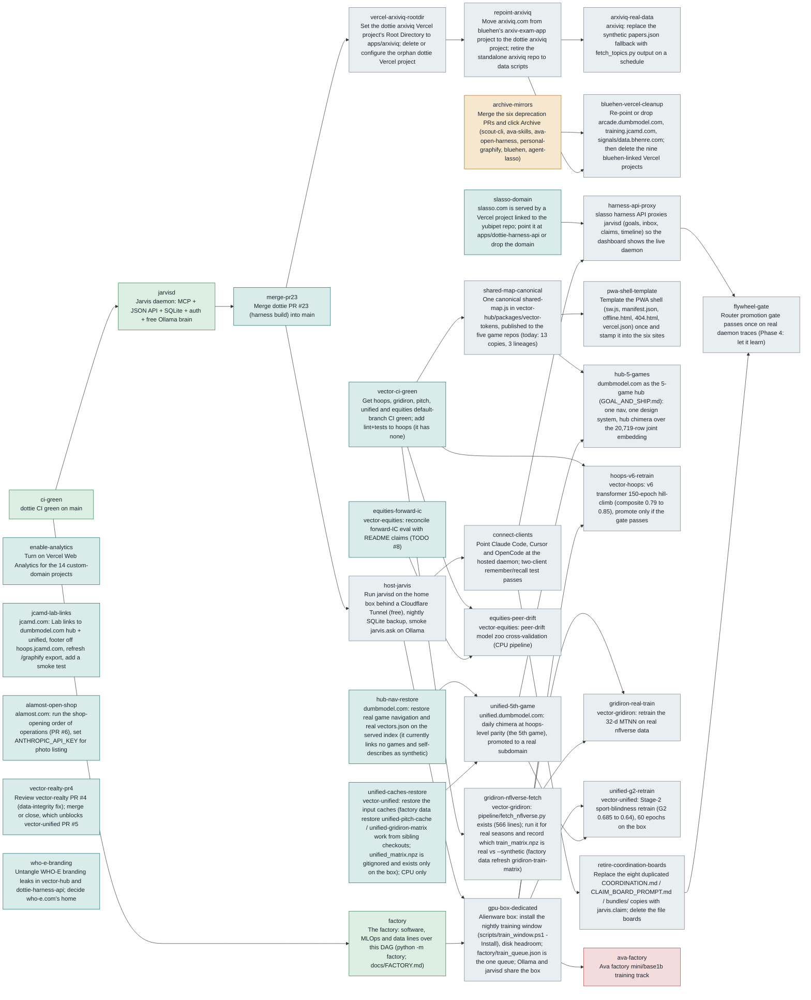

# The unified project DAG — what to work on, in what order

**Source of truth:** [`project_dag.json`](project_dag.json) (machine-readable). This page
is generated commentary; when the two disagree, the JSON is right and `scripts/dag_next.py
--mermaid` regenerates the picture below. **Updated 2026-09-05.**

## How to use it

```bash
python scripts/dag_next.py            # READY (in priority order), IN PROGRESS, BLOCKED, tally
python scripts/dag_next.py --repo vector-hub
python scripts/dag_next.py --check    # CI gate: unique ids, deps resolve, no cycles
python scripts/dag_next.py --mermaid  # regenerate the graph source
python -m factory start <node>        # ready -> in_progress, prints the repo and its validate gate
python -m factory done <node> --evidence "..."   # in_progress -> done; docs/FACTORY.md
```

Every Claude Code session in this repo opens with the frontier line (the SessionStart
hook reads this file), so the first question of a session is already answered: the
lowest-priority-number READY node in your repo. Work that, mark it `done` in the JSON,
open a PR. A node is READY when it is not done and every `depends_on` is done; READY and
BLOCKED are recomputed, never hand-set. `parked` nodes never enter the frontier.

## The shape of the graph

Five layers, read left to right. Product nodes sit on top of shared-infra nodes, and the
GPU-bound retrains sit behind one node (`gpu-box-dedicated`) because they all wait on the
same machine getting a schedule.

1. **Roots (this week).** `ci-green` and `jarvisd` are done. `merge-pr23` and
   `enable-analytics` are the two operator clicks that unblock the most. Analytics is
   first because every product has it off: there is no usage signal in the account, so
   "opportunistic" is still a guess until 30 days of data exist.
2. **Opportunistic products, no dependencies.** `jcamd-lab-links` (the only lead
   mechanism in the portfolio is that site's mail link; its Lab section misses the hub),
   `alamost-open-shop` (a finished product waiting on operator steps),
   `hub-nav-restore` (dumbmodel.com's served page links to none of its games).
3. **Shared infra the family builds on.** `vector-ci-green` (five red default branches),
   then `shared-map-canonical` (13 copies of the map engine in 3 lineages),
   `pwa-shell-template`, `unified-caches-restore` (CPU-only file copies), and
   `retire-coordination-boards` once the daemon is hosted.
4. **The 5-game hub.** `unified-5th-game` needs the caches and the hub nav;
   `hub-5-games` needs the 5th game and the canonical map. This is where
   `GOAL_AND_SHIP.md`'s "5-game hub at hoops-level parity" actually lands.
5. **GPU-bound research.** `hoops-v6-retrain`, `gridiron-real-train`,
   `unified-g2-retrain`, and the parked `ava-factory`, all behind `gpu-box-dedicated`,
   which itself follows `host-jarvis` because the same box hosts the daemon.

Cross-cutting ops that fix real confusion: `repoint-arxiviq` (arxiviq.com is served from
the archived bluehen repo today), `bluehen-vercel-cleanup` (nine Vercel projects still
build from bluehen, four with live domains), `slasso-domain` (slasso.com is served by a
project linked to a repo called yubipet).

## What deliberately is not in the graph

vector-arcade, vector-fusion-demo, component-books, the two Cursor skill packs, the
profile README. None of them consume shared infra or have users to serve, and adding
nodes for "leave alone" is how a graph turns back into a list.

## The picture


