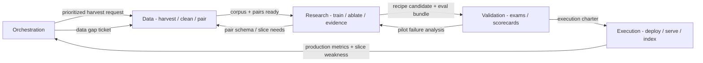

# Spec 0012 — Operating Loop / Promotion Pipeline (salvaged excerpts)

> **Salvage provenance**
> - Source repo: Blue Hen RE monorepo (`bluehenre`), github.com/jcdavis131/henington-homes
> - Source path: `specs/0012-synthetic-org-divisions-and-handoffs.md`
> - Source commit: `6c4cb9da0d43cb9f5379bf4ab731d597f8b47f55` (2026-08-03)
> - Copied: 2026-08-09 into dottie per `docs/CONSOLIDATION.md`
> - Edits: excerpts only — sections 2 (closed loop), 4 (handoff contracts, Research->BD and
>   BD->Execution), 6 (slasso ownership), and 8 (ledger stages) carried near-verbatim. The
>   five-division RACI matrix, agent rosters, and site-mapping material are superseded by
>   dottie's own `COORDINATION.md` and were not copied.

**Why salvaged:** these sections are the semantics of the promotion queue the slasso.com
dashboard renders — the ledger stage decoder, the queue-entry contract, the charter
contract, and the stall rules. Monorepo paths refer to the deprecated repo.

---

## §2 Closed loop (excerpt)

### Loop steps (normative order)

1. **Orchestration** identifies weakness (weakest slice, new vertical, stalled ledger) or the Operator sets priority.
2. **Data** harvests sources, chunks, generates pairs; logs `collect | chunk | pairs`.
3. **Research** trains with validated recipe, runs eval-harness, updates the evidence ledger; logs `train | eval`.
4. **Research** submits candidate to the Validation Queue (`content/fleet/bd/queue.json`) when promotion gates pass (Spec 0008).
5. **Validation (BD)** runs exams vs commercial baselines; produces scorecard; logs `pilot`.
6. **Validation (BD)** issues execution charter (approved recipe JSON); logs `charter`.
7. **Execution** deploys checkpoint, builds index; logs `deploy | index`.
8. Production metrics return to Orchestration; data-gap tickets route back to **Data**.

Each stage improving raises the floor for every downstream handoff.

## §4 Handoff contracts (excerpt — the two the dashboard renders)

### Research -> Validation (queue-entry contract)

**Research delivers:**

- Queue entry in `content/fleet/bd/queue.json`: recipe JSON, checkpoint path, eval-harness
  gates, evidence snapshot date.
- Reproducible command + seed.
- Limitations note (in-domain gain vs zero-shot OOD).

**Validation expects:**

- All Spec 0008 gates documented (real-text delta-nDCG, edge tiers where applicable).
- No marketing claims without a measured row in the evidence ledger.

**Validation may reject** with: exam regression, commercial baseline wins, missing artifact.

### Validation -> Execution (charter contract)

**Validation delivers:**

- Signed charter: approved update to `config/recipes/{siteId}.json`.
- Scorecard JSON: pass/fail per exam, rollout tier notes.
- Rollback criteria.

**Execution expects:**

- Charter before any production recipe change.

**Execution may reject** with: deploy gate failure, cost ceiling, isolation test failure.

## §6 slasso.com ownership (excerpt)

benchmark-lab (slasso.com):

- **Owns:** exam definitions, leaderboard integrity, commercial baseline panel config.
- **Expects from Research:** queue entries with reproducible artifacts.
- **Delivers to Execution:** charter JSON on pass; to Research: failure slice analysis.

## §8 Ledger stages (cross-division signals)

Append-only operations ledger. Stages:

| Stage | Division | Meaning |
|-------|----------|---------|
| `collect` | Data | Raw sources ingested |
| `chunk` | Data | Chunking complete |
| `pairs` | Data | Contrastive pairs ready — Research may enqueue train |
| `train` | Research | Training job started/completed |
| `eval` | Research | Eval-harness gates run |
| `pilot` | Validation | Real-world exam scorecard recorded |
| `charter` | Validation | Execution approved to deploy |
| `deploy` | Execution | Checkpoint promoted |
| `index` | Execution | Vector index built — loop metrics live |

**Stall rules:** `pairs` without `train` > 48h escalates to Research; `eval` without a queue
entry triggers a promotion-criteria reminder.
